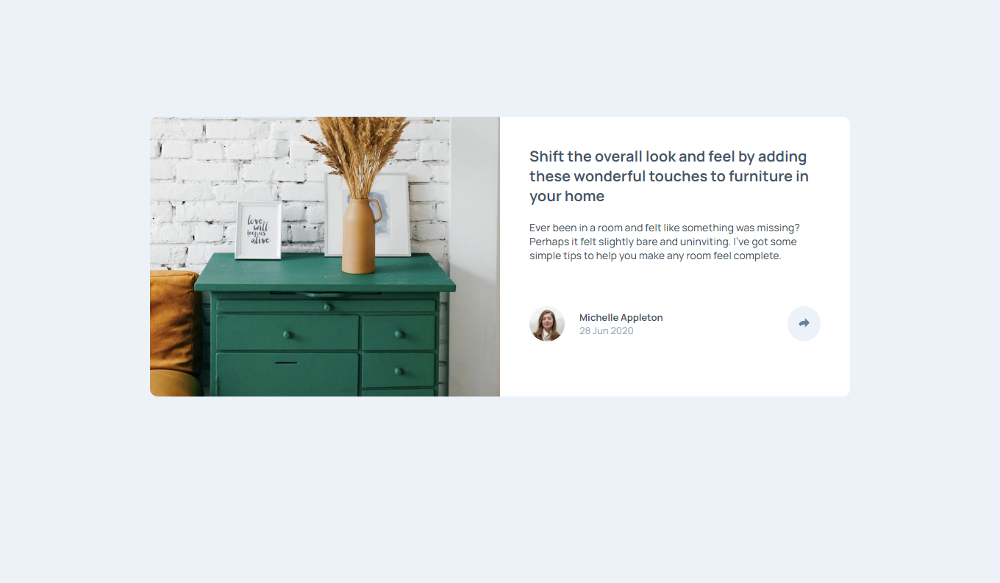

# Frontend Mentor - Stats preview card component solution

This is a solution to the [Article preview component challenge on Frontend Mentor](https://www.frontendmentor.io/challenges/article-preview-component-dYBN_pYFT). Frontend Mentor challenges help you improve your coding skills by building realistic projects.

## Table of contents

- [Frontend Mentor - Stats preview card component solution](#frontend-mentor---stats-preview-card-component-solution)
  - [Table of contents](#table-of-contents)
  - [Overview](#overview)
    - [The challenge](#the-challenge)
    - [Screenshot](#screenshot)
    - [Links](#links)
    - [Built with](#built-with)
    - [Continued development](#continued-development)
  - [Author](#author)

## Overview

### The challenge

Users should be able to:

- View the optimal layout depending on their device's screen size
- See hover states for interactive elements

### Screenshot

### Links

- Solution URL: [Frontend Mentor](https://www.frontendmentor.io/solutions/responsive-article-preview-component-7acDGxLHE)
- Live Site URL: [Live Preview](https://article-preview-component-anthony-rosman.netlify.app/)

### Built with

- Semantic HTML5 markup
- CSS custom properties
- Flexbox
- CSS Grid
- Vanilla Js
- Mobile-first workflow

### Continued development

Im currently learning Reactjs because i like the way how thats work.

## Author

- Website - [Anthony Rosman](https://bit.ly/portafolioanthony)
- Frontend Mentor - [@D3press3dd](https://www.frontendmentor.io/profile/D3press3dd)
